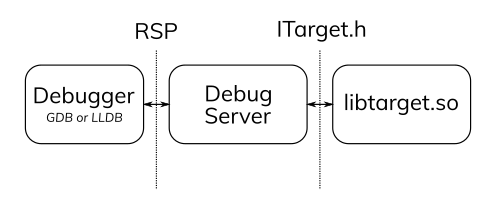

.. Copyright (C) 2019 Embecosm Limited
   SPDX-License-Identifier: CC-BY-SA-4.0

Overview
--------

The Embecosm Debug Server is a portable, retargetable debug server
used to control bare-metal targets from GDB and LLDB. It is
comprised of a generic core and a target interface used to
specialize it for a given implementation.

Structure of the Debug Server
`````````````````````````````

The Debug Server acts as a bridge which allows a debugger to control
hardware or an simulator of hardware. The debug server talks to the
debugger using the text-based Remote Serial Protocol (see
:ref:`remote-serial-protocol`). This is a two-way communication
channel where the Debug Server acts as a server which handles
requires from the client, the debugger. Typically the communication
is over a socket, but it can also be performed locally over standard
input/output.



Within the Debug Server the Remote Serial Protocol (RSP) packets are
parsed, and then various calls are made to the target interface
to control the target. For some RSP packets, there is a close
correspondence between the packet and the relevant method in the
interface, but other packets have more complex behaviour.

The Target Interface
````````````````````

A target can take many forms. It can be an ISA simulator, a cycle accurate
model, an FPGA, a development board, etc. The target interface exists to
map from the high level commands received from the debugger into a small
set of functions in which target-dependent code can be written to
drive a simulator or send the right signals to hardware.

Writing a new target requires that an implementor derives from the
``ITarget`` abstract class, and then builds their concrete implementation
into a shared object. This shared object can then be provided as an
argument to the ``embdebug`` program to initialize a debug server
for the user's own target.

For a detailed guide on how to implement a new target for the
debug server, see :ref:`porting-debug-server`.

Lockstep
````````

*To be written.*
